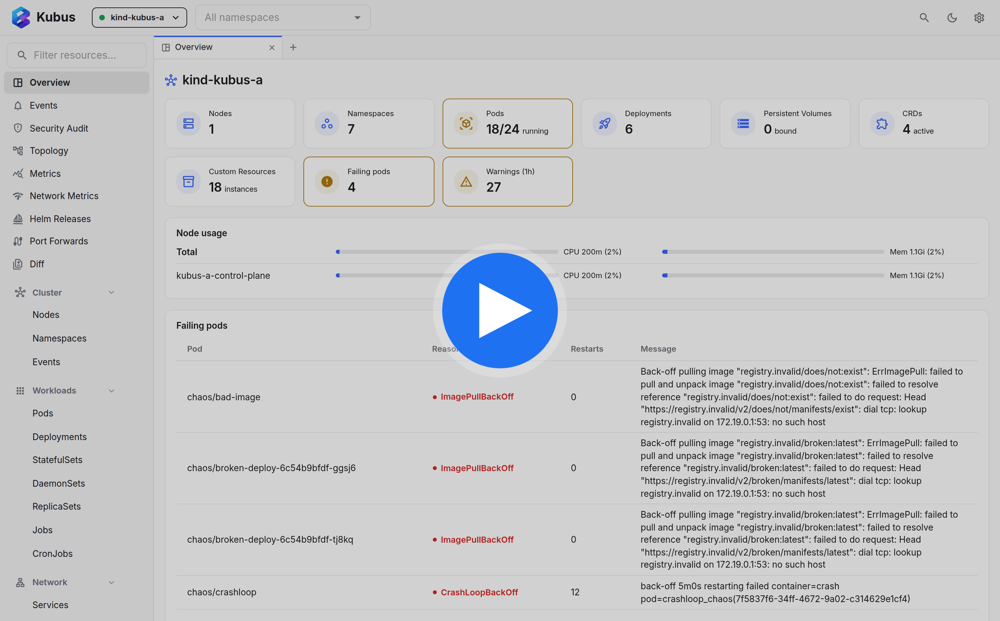

# Kubus

Kubus is a free, open-source Kubernetes GUI for working across clusters from
your local machine. It uses your existing kubeconfig to browse and edit
resources, stream logs, open shells, forward ports, watch metrics, inspect Helm
releases, and more.

**The docs are the main entry point:** [kubus-app.dev](https://kubus-app.dev/)

[](https://www.youtube.com/watch?v=b86yKodD5Mw)

## Start Here

- [Install Kubus](https://kubus-app.dev/install/)
- [Quickstart](https://kubus-app.dev/quickstart/)
- [User guide](https://kubus-app.dev/guide/)
- [Reference](https://kubus-app.dev/reference/)
- [Contributing and development](https://kubus-app.dev/community/)
- [Desktop releases](https://github.com/FloSch62/Kubus/releases)


## Run From Source

Requires Node.js >= 24.21 and pnpm 12:

```bash
pnpm install
pnpm build
pnpm start
```

For development setup, release steps, architecture, security details, and test
clusters, use the docs.

An optional [Needle WASM trial](needle/README.md) answers cluster questions from
live resource data and turns pod requests into previewable table filters.
Question interpretation runs locally; the [Kubus harness](needle/finetune/harness.md)
adds pod lookup, recent failures, deployment/event summaries and evidence-based
pod diagnosis, with a reproducible local fine-tuning recipe.
Run `pnpm setup:needle` before starting development or building the desktop app.

## Support

<a href="https://www.buymeacoffee.com/FloSch62">
  
</a>

## License

[MIT](./LICENSE)
