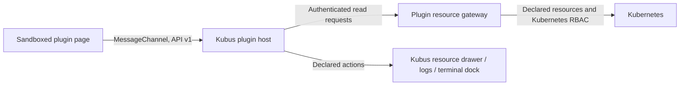

# Kubus plugins

Enable **Clabernetes** in **Settings → Plugins**. It appears immediately below Diff. Activation persists across restarts and is shared by Kubus windows. Disabling removes the navigation item, unmounts open plugin pages, and immediately revokes server access. Existing tabs show a disabled message and can be reopened after enabling.

The shipped Clabernetes workspace follows Kubus's selected clusters, namespaces and theme. Kubernetes resources stream through the same shared list/watch machinery as Kubus, with automatic reconnects and no refresh buttons. A single **Workspace scope** selector switches between **All labs** and one namespace lab; the same Nodes, Links, Files, Access, Storage and Events views apply to either scope. Labs need no Topology resource: directly authored Nodes and Links are first-class. The Labs overview opens a topology with a compact device tray; there is only one main Nodes tab. Platform contains NodeProfiles, the manager and planning workers, global Config and Helm installation details.

The workspace uses Kubus's MUI / MUI X theme, searchable device grids and the local clab-viewer. Shell and log actions open the native Kubus dock. Container menus separate application, preparation (`planner`) and connectivity (`clabwire`) logs. The device inspector connects runtime readiness, live interfaces, configuration files, NodeProfile and global Config. Kubernetes details remain available in the tables without crowding the everyday device view.

Links actively sample Linux interface state in their running application containers through the declared `pod.interfaces` capability. Each endpoint shows administrative state and carrier; a link is up only when both observed endpoints are up. Observations include timestamps, and missing interfaces, replaced Nodes, inspection failures and unsupported containers remain explicit. This is sampled interface state, not an end-to-end packet or routing test. Kubernetes acceptance and aggregate wiring reconciliation remain separate diagnostic columns. The live `st` deployment supports this inspection even though its Link CRD does not expose carrier. Sampling runs automatically without a Check now button and respects inactive panes and refresh settings (`off` pauses sampling), uses at most four requests at a time, and deduplicates identical Pod/container reads.

Files traces Node `filesFromConfigMap` declarations through data keys, staged paths and containerlab file/directory binds to device destinations. It includes startup configuration, user files, mounted plan/input/connectivity maps, unmounted generated artifacts, and optionally shared mounts such as the peer directory. ConfigMaps open in Kubus for inspection and editing. A mounted map is a Pod input, not proof of the device's running configuration; saved configuration is handled by device persistence. Secret and URL payload references are shown without reading their contents. Platform relates Helm ownership, bootstrap merge/overwrite policy and global Config; the Helm button opens Kubus's existing release page.

## Boundaries



- Plugins are static HTML, JavaScript, CSS, and asset bundles. They cannot register server handlers, import Kubus implementation modules, replace existing pages, patch application stores, or receive kubeconfig credentials or the Kubus session token.
- Each page has a separate opaque-origin iframe with `sandbox="allow-scripts"`. The server also enforces the sandbox with CSP on direct asset loads. Plugins cannot access the parent DOM, cookies/storage, Electron APIs, popups, or top-level navigation. Network connections, nested frames, and arbitrary external scripts are blocked by CSP. Module assets alone allow cross-origin loading for the opaque iframe.
- A dedicated transferred MessagePort binds a plugin to its host frame. Requests are validated against the manifest and the current window's selected clusters and namespaces. Inactive tabs cannot request data or launch host actions. Scope changes cancel in-flight requests; stale results are discarded. Host resources and ports are released on unmount.
- The server independently enforces enabled state, exact API group/resource permissions, API discovery, validated GVR segments, and Secret redaction. Resource access is read-only. The separate interface capability executes one fixed inspection command. No wildcards, arbitrary URLs, HTTP methods, caller-supplied commands, or cluster credentials cross the API.
- Install only plugins from authors you trust with the declared resource data. Browser containment is not a guarantee against hostile resource consumption or every possible browser side channel. In particular, this is not an OS process sandbox or a remote plugin marketplace.

## Install without changing Kubus

Build a directory containing `kubus-plugin.json`, `index.html`, and its relative assets. In Settings → Plugins, enter its **absolute directory path on the machine running Kubus**, then Install. Review the permission list and enable it. Kubus copies a snapshot into the `plugins` directory next to its settings file (`$XDG_CONFIG_HOME/kubus`, or `~/.config/kubus`). Subsequent edits to the original directory do not change the installed plugin.

Bundles may contain up to 2,000 files / 64 MiB, nested at most eight directories deep. Symlinks, hidden files, and non-static file types are rejected. Supported assets are HTML, JS/MJS, CSS, JSON, SVG, PNG, JPEG, WebP, WOFF/WOFF2, and text. Set your bundler's base to `./`; avoid inline scripts, remote dependencies, source maps, and runtime fetches. Use the host SDK for data access. All dependencies must be bundled.

Local plugins can be removed in Settings. To update, remove the old version and install a freshly built directory; the replacement starts disabled so changed permissions can be reviewed. Shipped plugins can be disabled but not removed or shadowed by local plugins. Invalid bundles are rejected; a broken installed bundle is skipped with a server diagnostic rather than preventing Kubus startup.

Try the zero-build example at `plugins/examples/hello-world` to verify installation and context updates.

## Manifest and API v1

```json
{
  "apiVersion": 1,
  "id": "my-workspace",
  "name": "My workspace",
  "version": "0.1.0",
  "description": "Inspect my operator's resources.",
  "author": "Your team",
  "entry": "index.html",
  "permissions": {
    "resources": [{ "group": "example.com", "resources": ["widgets"] }],
    "actions": ["resource.open"]
  }
}
```

The ID must be a lowercase, hyphen-separated identifier (2–64 characters). API versions are explicit; unsupported versions and unknown manifest fields are rejected. Permissions grant read access to exact plural resource names in exact API groups, across versions the cluster serves. Use an empty group for core Kubernetes resources. All granted resources may contain sensitive configuration even when they are not Secrets.

The independent, dependency-free browser SDK is in `plugins/sdk`. It exports TypeScript source for bundlers and can be installed into an external project with `pnpm add /absolute/path/to/Kubus/plugins/sdk`. It has no dependency on Kubus internals. The versioned protocol types are exported from `@kubus/plugin-sdk/protocol`.

```ts
import { connectPlugin } from '@kubus/plugin-sdk';

const kubus = connectPlugin(async (context) => {
  // Runs on connection and on context/theme/visibility/refresh changes.
  if (!context.active) return;
  for (const ctx of context.contexts) {
    const namespaces = context.namespacesByContext[ctx] ?? [];
    // An empty selection means all namespaces. A nonempty selection must
    // be queried per namespace; the host rejects reads outside that scope.
    for (const namespace of namespaces.length ? namespaces : [undefined]) {
      const query = { ctx, namespace, group: 'example.com', version: 'v1', plural: 'widgets' };
      const page = await kubus.list(query);
      // Render page.items; pass page.continue to list() for the next page.
    }
  }
});

window.addEventListener('pagehide', () => kubus.dispose(), { once: true });
```

Keep the connection stable for the lifetime of the page. Handle rejected promises and discard async results after context changes. Respect `active` and `refreshInterval` (`false` means no background polling). Resource watches stay live independently of the polling refresh setting. The shipped c9s plugin demonstrates streamed snapshots and changes, partial failures, scope cleanup, and bounded interface sampling.

| SDK method | Permission | Result |
| --- | --- | --- |
| `list({ctx, group, version, plural, namespace?, labelSelector?, continue?})` | Exact resource read grant | `{items, continue?}`, up to 500 per page |
| `watch({ctx, group, version, plural, namespace?}, onUpdate)` | Exact resource read grant | Initial snapshot, batched add/modify/delete events and connection status; returns an unsubscribe function |
| `get({...resource, name})` | Exact resource read grant | Kubernetes object |
| `openResource({...resource, name})` | Read grant + `resource.open` | Opens Kubus's resource drawer |
| `openLogs({...pod, name, container?})` | Core pods read + `pod.logs` | Opens Kubus's log dock |
| `openHelmRelease({...resource, name})` | Resource read + `helm.open` | Opens the associated Helm release using freshly read ownership metadata; the release namespace must also be selected |
| `readPodInterfaces({...pod, name, container})` | Core pods read + `pod.interfaces` | Timestamped interface snapshot from a running application container |
| `openTerminal({...pod, name, container?})` | Core pods read + `pod.terminal` | Opens a host terminal; accepts no commands |

Named namespaced resources require a namespace. Pod actions require core/v1/pods. Host actions re-read the named resource before opening it. Enabling a plugin grants its declared host actions, including opening a terminal when `pod.terminal` is declared. `helm.open` only navigates to the existing Kubus Helm page; it neither reads release Secrets into the plugin nor grants Helm mutation methods. Navigation and dock actions acknowledge opening the host UI, not a successful Kubernetes connection. Logs accept application and init containers; terminals accept application containers only. Omitting a container respects the Pod’s default-container annotation, then falls back to its first application container. Requests time out after 30 seconds; the host allows at most 24 concurrent requests and 500 resource watches per frame. Watches have no request timeout: call their unsubscribe function before changing scope or disposing a view. Watch updates have `kind: snapshot`, `events`, or `status`; a new snapshot replaces the collection after reconnect. The host supplies plugin identity and namespace scope, and the server checks discovery, read permissions and enabled state before forwarding snapshots or changes. The iframe receives no socket credentials.

`pod.interfaces` is a generic host capability, with no c9s-specific server logic. The server re-reads the Pod, validates its running application container and selected namespace, and runs exactly `ip -j link show` without a shell, stdin or TTY. It returns only normalized interface fields, Pod UID, container and observation time. Inspection requires Kubernetes Pod exec permission and iproute2 in that container. The operation has an 8-second deadline, a 1 MiB output cap and a server limit of eight concurrent inspections. Disconnects cancel the upstream socket; disabling the plugin prevents an in-flight response from being returned. The plugin cannot supply a command or use this capability to change interfaces.

## Match the Kubus UI

`@kubus/ui-theme` is an optional public presentation package in `plugins/ui-theme`, shared by the host and shipped plugin. It exports `buildTheme(mode)` and the status-text color helper; its MUI / MUI X theme supplies the same palettes, typography, tabs, fields, grids, menus, and focus styles as Kubus. Wrap plugin components in MUI's `ThemeProvider` and `CssBaseline`, and bundle the Inter and JetBrains Mono fonts. This package contains presentation only—no host stores, API clients, routing, or plugin lifecycle. Plugins may use another UI framework; the dependency-free SDK remains separate.

## Local clab-viewer

The c9s plugin currently consumes the unreleased viewer as `plugins/clabernetes/vendor/clab-viewer-0.1.0.tgz`, packed from the local containerlab-app checkout at `be0ec244e60367a5e1f3aa8b5b68af6290ac4654`. Its MIT license is inside the package. This makes builds independent of an absolute local checkout path or an unpublished registry package. Kubus's normal client build builds the c9s bundle and includes it in web and Electron assets.

To refresh that local snapshot:

```sh
cd /path/to/containerlab-app/packages/clab-viewer
pnpm build
pnpm pack --ignore-scripts --out /path/to/Kubus/plugins/clabernetes/vendor/clab-viewer-0.1.0.tgz
cd /path/to/Kubus
pnpm install --force
pnpm --filter @kubus/client build
```

After publication, replace the file dependency in the c9s package with the published version and update the lockfile. No host changes are needed.

The c9s adapter targets the local `c9s.run/v1alpha1` API. Older releases without Node/Link CRDs retain the topology canvas and source, with explicit unavailable-resource diagnostics. Node counts can fall back to YAML; unreported readiness remains unknown. Large definitions above 2 MB are kept out of the canvas. Lab events are matched by object UID, and controller resources follow namespace filtering just like other resources.
