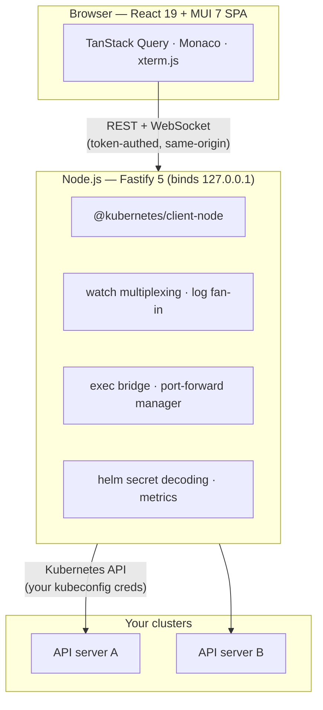

# Architecture

Kubus is a small, two-tier app: a React single-page app in your browser, talking to a
local Node.js server that holds the connections to your clusters. The server is the only
thing that touches Kubernetes — the browser never connects to an API server directly.

## The browser

A React 19 single-page app built with MUI 7. Notable pieces:

- **TanStack Query** for data fetching and caching,
- **Monaco** for the YAML editor and diff views,
- **xterm.js** for the terminals.

It talks to the server over REST and WebSocket on the **same origin**, carrying the
[access token](security.md) on every request.

## The server

A Fastify 5 server using the official **`@kubernetes/client-node`**. It does the heavy
lifting that a browser can't:

- **Watch multiplexing** — one set of informer-style watches per cluster, fanned out to
  every list that needs them, with automatic `410 Gone` reconnect/resync.
- **Log fan-in** — aggregates logs from many pods into a single stream.
- **Exec bridge** — proxies the Kubernetes `exec` API to xterm.js over WebSocket, for
  container shells and the node shell.
- **Port-forward manager** — owns long-lived forwards and reports their state.
- **Helm** — decodes release secrets (base64 → gzip → JSON) so there's no `helm` binary
  dependency.
- **Metrics** — polls metrics-server and keeps a rolling history buffer for the charts.

## The desktop shell

The desktop app is an **Electron** wrapper. It runs the very same server in-process on a
random localhost port, opens it in a native window, and persists window state between
launches. There's no separate codebase for the desktop UI — it's the same SPA.

## Data flow in one sentence

Your browser asks the local server; the local server asks your clusters with your
kubeconfig credentials; nothing leaves your machine.

## See also

-   :material-shield-lock: **[Security model](security.md)** — the trust boundaries in detail
-   :material-source-branch: **[Building from source](../community/development.md)** — run it yourself

