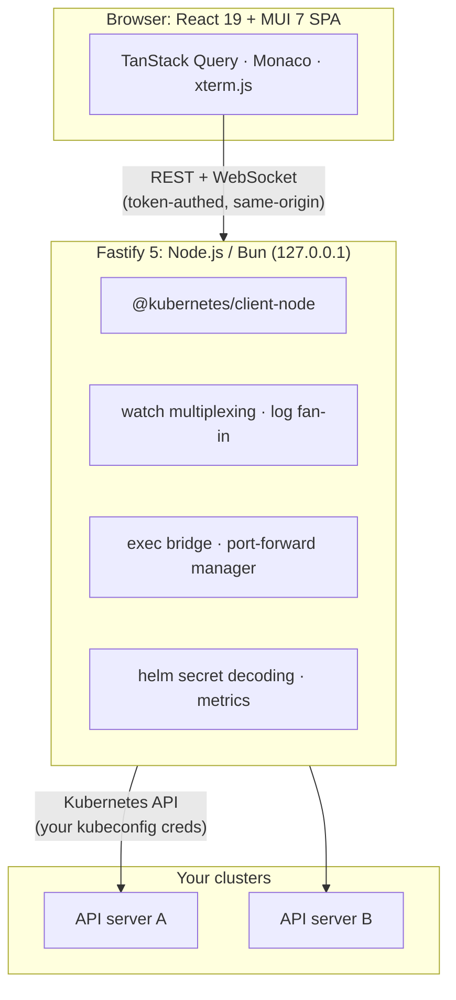

# Architecture

Kubus is a small, two-tier app: a React single-page app in your browser, talking to a
local Fastify server (Node.js standalone, Bun in the desktop app) that holds the connections to your clusters. The server is the only
thing that touches Kubernetes. The browser never connects to an API server directly.

```mermaid
graph TD
  subgraph Browser["Browser: React 19 + MUI 7 SPA"]
    UI["TanStack Query · Monaco · xterm.js"]
  end
  subgraph Server["Fastify 5: Node.js / Bun (127.0.0.1)"]
    K["@kubernetes/client-node"]
    W["watch multiplexing · log fan-in"]
    E["exec bridge · port-forward manager"]
    H["helm secret decoding · metrics"]
  end
  subgraph Clusters["Your clusters"]
    A["API server A"]
    B["API server B"]
  end
  UI -- "REST + WebSocket<br/>(token-authed, same-origin)" --> Server
  Server -- "Kubernetes API<br/>(your kubeconfig creds)" --> A
  Server --> B
```

## The browser

A React 19 single-page app built with MUI 7. Notable pieces:

- **TanStack Query** for data fetching and caching,
- **Monaco** for the YAML editor and diff views,
- **xterm.js** for the terminals.

It talks to the server over REST and WebSocket on the **same origin**, carrying the
[access token](security.md) on every request.

## The server

A Fastify 5 server using the official **`@kubernetes/client-node`**. It does the heavy
lifting that a browser can't:

- **Watch multiplexing**: keeps one set of informer-style watches per cluster and fans
  them out to every list that needs them, with automatic `410 Gone` reconnect/resync.
- **Log fan-in**: aggregates logs from many pods into a single stream.
- **Exec bridge**: proxies the Kubernetes `exec` API to xterm.js over WebSocket, for
  container shells and the node shell.
- **Port-forward manager**: owns long-lived forwards and reports their state.
- **Helm**: decodes release secrets (base64 → gzip → JSON) so there's no `helm` binary
  dependency.
- **Metrics**: polls metrics-server and keeps a rolling history buffer for the charts.

## The desktop shell

The desktop app uses **Electrobun 2** with a **Bun** main process and the system webview (WKWebView on macOS, WebKitGTK on Linux, WebView2 on Windows). It runs the very same server in-process on a
random localhost port, opens it in a native window, and persists window state between
launches. The renderer calls native window actions through typed Electrobun RPC. A bootstrap worker claims the single-instance socket before the native UI initializes, and a small native URL relay forwards `kubus://` links. There's no separate codebase for the desktop UI; it's the same SPA.

The main process is bundled with Node dependency resolution before Electrobun packages it for Bun. This preserves the Kubernetes client's real HTTP and WebSocket implementations, including client certificates, custom CAs, and proxy agents. Helm runs in an in-memory WASI host shared by both runtimes.

## Data flow in one sentence

Your browser asks the local server; the local server asks your clusters with your
kubeconfig credentials; nothing leaves your machine.

## See also

-   :material-shield-lock: **[Security model](security.md)** covers the trust boundaries in detail.
-   :material-source-branch: **[Building from source](../community/development.md)** shows how to run it yourself.

